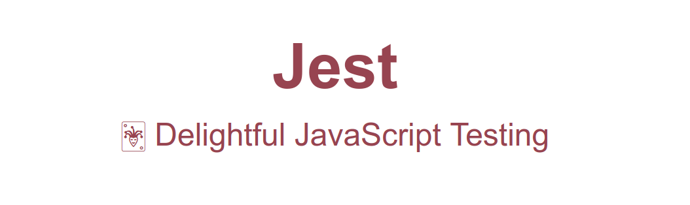

# Jest Getting Started

https://jestjs.io/docs/pt-BR/getting-started.html

Instalação

    npm install --save-dev jest
    // added 462 packages from 356 contributors and audited 877518 packages in 65.596s
    //
    // 14 packages are looking for funding
    // run `npm fund` for details
    //
    // found 0 vulnerabilities

Caracas, 462 pacotes !!!

    yarn add --dev jest
    // success Saved 295 new dependencies.

Testando

    npm test
    yarn test

Resultado

    PASS  ./sum.test.js
    ✓ adds 1 + 2 to equal 3 (3ms)

    Test Suites: 1 passed, 1 total
    Tests:       1 passed, 1 total
    Snapshots:   0 total
    Time:        5.899s
    Ran all test suites.

### Architecture

Jest Architecture Overview

https://youtu.be/3YDiloj8_d0
